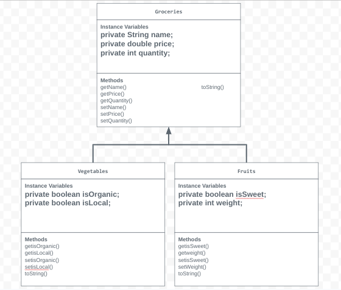

# Unit 2 - Store Management Project

## Introduction

You are opening a new business in your community! Businesses often need programs to manage the products and services they offer and track orders and requests from customers. Your goal is to create a store management system for your business.

## Requirements

Use your knowledge of object-oriented programming and class structure and design to create your store management system:
- **Create a class hierarchy** – Develop a superclass that represents a product or service your business offers and one or more subclasses that extend the superclass to represent more specific types of products or services.
- **Declare instance variables** – Declare instance variables in the superclass that are shared with the subclasses and instance variables in the subclasses that are not shared with the superclass.
- **Write constructors** – Write no-argument and parameterized constructors in the superclass and subclasses. Subclass constructors use the super keyword to call the superclass constructor.
- **Implement accessor and mutator methods** – Write accessor and mutator methods for instance variables that should be accessible and/or modifiable from outside of the class.
- **Implement a toString() method** – Write toString() methods in the superclass and subclasses that return information about the state of an object.

## UML Diagram

## Description

This store is a Grocery Store. I chose this topic because I go grocery shopping often and I was curious how these stores track their produce. I created a Groceries superclass to represent groceries like vegetables and fruits that are available in this grocery store. The subclass was a vegetables class since this produce makes up a significant part of stores. Another subclass of the store was a fruits class. The question that is shown to users is "What are the availabe groceries?" To this, the program responds with a list of groceries, fruits, and vegetables with the name, price, quantity, whether it is local, and whether it is organic. 
